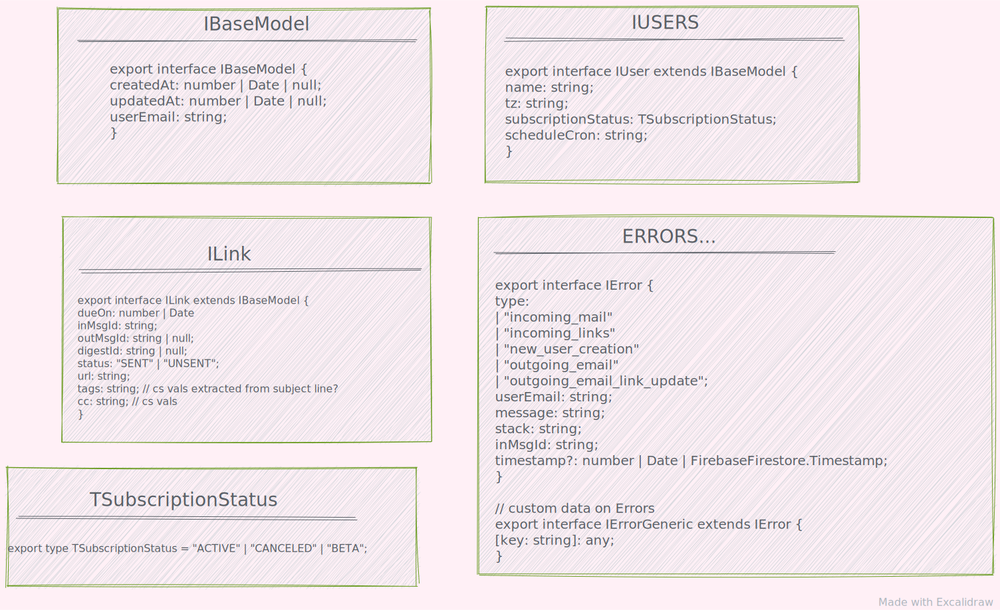
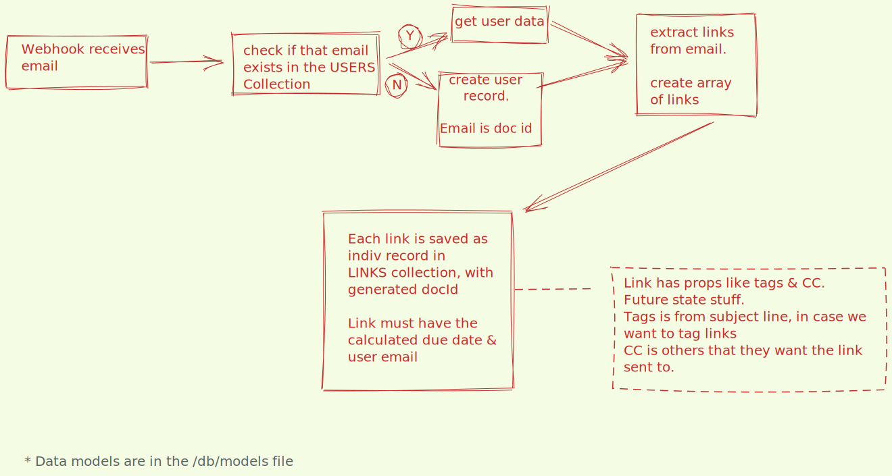
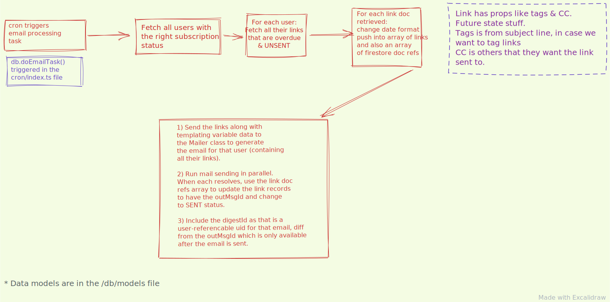

# ekko

### TODO

-   Auth
-   use Bull to queue? PubSub?

### `Diagrams`

-   DataModels
    

-   Incoming Mail Handling Flow
    

-   Mail out task flow
    

### `Resources and References`

-   [Service Account Keys](https://firebase.google.com/docs/admin/setup?authuser=1)

-   [Conflguring emulators](https://firebase.google.com/docs/emulator-suite/install_and_configure)

-   [import data to Firebase Firestore ](https://levelup.gitconnected.com/firebase-import-json-to-firestore-ed6a4adc2b57)

-   [NODE Firebase Firestore SDK reference](https://googleapis.dev/nodejs/firestore/latest/CollectionReference.html#orderBy)

-   [CRUD in firestore](https://softauthor.com/firestore-querying-filtering-data-for-web/)

-   [batched versus parallelized writes](https://stackoverflow.com/questions/58897274/what-is-the-fastest-way-to-write-a-lot-of-documents-to-firestore)

-   [React bootstrap login form](https://www.positronx.io/build-react-login-sign-up-ui-template-with-bootstrap-4/)

-   [ React firebase with auth](https://www.robinwieruch.de/complete-firebase-authentication-react-tutorial#firebase-in-react-setup)

### `Running the app`

##### Functions (Excluding API server)

-   Needs compiling in real time. you need to run a `build task` that runs the task code in `.vscode` in the project root. Start it up with the Command Palette > `Run Build Task`..., then choose`"tsc: watch"` on `functions/tsconfig.json`. This opens a window in the integrated terminal. [[Reference]](https://firebase.googleblog.com/2018/01/streamline-typescript-development-cloud-functions.html). You can also open a new terminal window and run `yarn watch` as it runs `tsc --watch`. But it needs its own terminal shell for that.

-   Note that real time compiling does not work for the EJS templates. Those need to be built with the `yarn build` script which also runs a `yarn copy` script to copy static files.

-   run `yarn serve:functions` from `/functions` to serve up the functions on port 5001. and `yarn tunnel` to set up ngrok for the functions at the same port.

-   Staging environments: local has no `env.context`. There is a Staging firebase project which is the project `ekkoappv0`. See the file`/context.ts` for details. In the firebase hosted project, the environment variables look like this. And they can be accessed with `firebase functions:config:get` from the CLI.

```
{
  "app": {
    "smtppass": "#SOME PASSWORD",
    "context": "staging"
  }
}
```

-   **DO NOT USE:** emulators, inpsect the `package.json`. Emulators try and load data from the `emulator-exports` folder. Its very important to export the data **BEFORE** shutting down the emulator. The emulator does not persist data and has some other challenges. Sending data directly to firebase is ok because the `context.js` files separates folders based on `STG` or `null` environment.

##### React Frontend

please read this in conjunction with the API server. ** always ALWAYS ** run a `yarn build` on the `/frontend` before you run `firebase deploy --only hosting`. Better yet use the `yarn deploy:hosting` script.

-   Start local dev from inside the `/frontend` folder with `yarn start`. **Serve the front end on port 3000** as the front end code reads the environment variables set in `/frontend/src/config/context.ts` in order to determine which routes to post axios requests to. Front end relies on `process.env.NODE_ENV` where as `firebase serve` does not seem to set that.

-   run `yarn build` to put built files in `/frontend/build`
-   **DO NOT USE** `firebase serve --only hosting` will read from the built folder only.

##### API server for front end

The API server handles the back end code for the React App.

-   Best to deploy the api separately with `firebase deploy --only functions:api`. Do it along with deploying the React app to hosting.

##### HTML emails

Browser support for CSS in emails is notoriously fickle.

-   see the html inliner tool here. https://github.com/leemunroe/responsive-html-email-template

-   awesome HTML with css inlining tool to help you code up the html and outputs with inline css: https://htmlemail.io/inline/ + app.postdrop.io

-   generate styled html tables with https://www.tablesgenerator.com/html_tables

### `DEVELOPER LINKS`

-   Google: Nitrous Account https://console.firebase.google.com/u/1/project/ekkoappv0/overview
-   Zoho API/KEYS : https://api-console.zoho.com/
-   Zoho webhooks: https://mail.zoho.com/zm/#settings/general/integrations-settings/DeveloperSpace
-   CloudMailin: Nitrous Account
-   web app on firebase hosting - https://ekkoappv0.web.app/
-   [/hooks endpoint - STG](https://us-central1-ekkoappv0.cloudfunctions.net/hook)
-   [GCP Logs viewer](https://console.cloud.google.com/logs/viewer?project=ekkoappv0)
